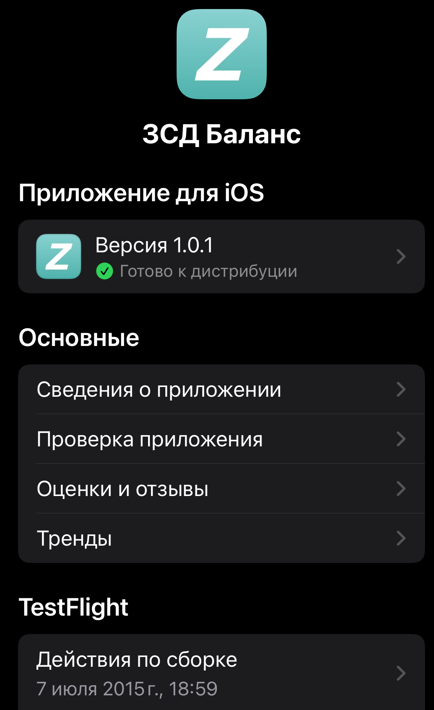
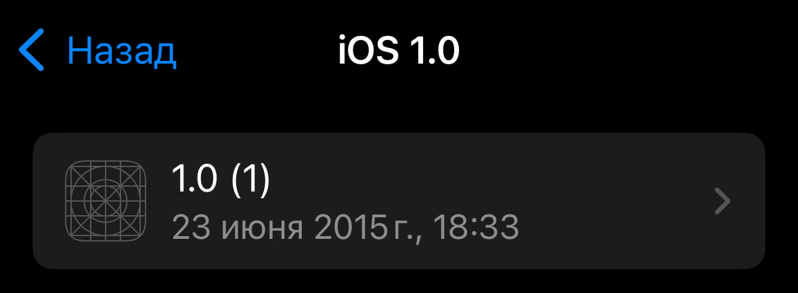
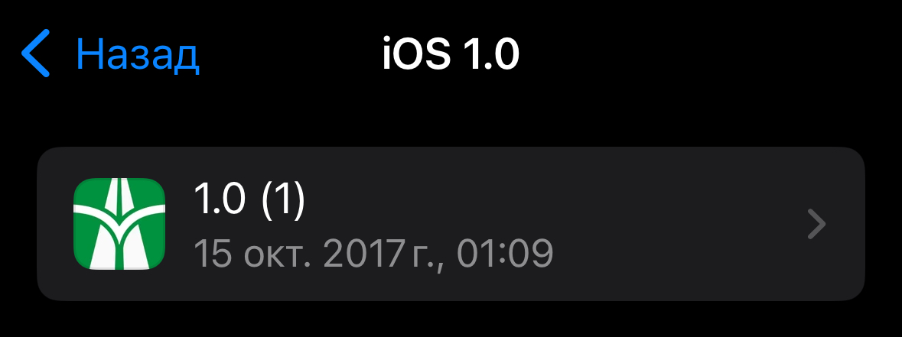
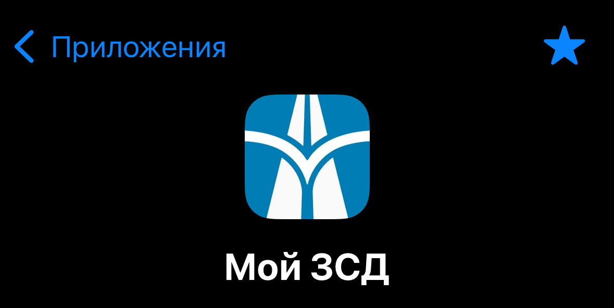

# История приложения

**В 2025 году исполняется 10 лет моим изысканиям, связанным с приложениями для ЗСД.**

## 2015 год, ЗСД Баланс

В далеком 2015 году ваш покорный слуга решил, что пора помимо web изучить что-то еще, выбор пал на недавно появившийся Swift.

Не найдя другого подходящего кандидата, было решено сделать приложение, которое показывает баланс ЗСД и при этом не разлогинивается каждый 2 недели.

Так 23 июня 2015 год появился "ЗСД Баланс". Приложение, давно отсутствующее в Appstore.

В этот момент у ЗСД еще нет своего приложения! Моё — единственное.

## 2017 год, Мой ЗСД

Идет 2017 год, я, съездив на конференцию по ReactNative, решаю написать новое приложение. Однако просто показывать баланс уже не интересно. Поэтому методом реверс-инжинирига я разбираю официальное приложение и узнаю, как устроено его api.

Так появляется "Мой ЗСД", цветовая гамма все еще зеленая, но в приложении уже можно делать почти все что в официальном. Оно не бажит, не разлогинивает.

Логотип для приложения сделала [Таня](https://t.me/exogenesis0).

## 2018 год, статья в Собака.ру

В 2018 году выходит статья про приложение в [интернет издании Собака.ру](https://www.sobaka.ru/lifestyle/technology/78414).

Кстати, фото в статье, с видом на стадион и ЗСД тоже мое.

## 2021 год, редизайн

В проект пришла [моя коллега Лена](https://t.me/mslarkina) и помогла устроить небольшой редизайн. Цветовая палитра меняется на синий с золотым (в цвет моей тогдашней машины).  

## 2025 год, из Appstore удалено официальное приложение, новая версия Мой ЗСД

2025 год я встречаю, уже довольно позабросив приложение, потому что уже несколько лет не живу в Петербурге и не езжу по ЗСД.

Однако происходит невероятное, из AppStore пропадает официальное приложение, вместо 20-30 установок в сутки "Мой ЗСД" начинают устанавливать 400-500 раз.

Начинают сыпаться негативные отзывы, мол, то не работает, это не работает. 

Я решаю все-таки починить проблемы, пересобираю приложение с нуля, обновляя все зависимости, переписываю виджет и решаю небольшой челендж.

Как итог, в мае 2025 года в свет выходит версия 4.1 приложения "Мой ЗСД". Спустя 3 года после последнего обновления.
