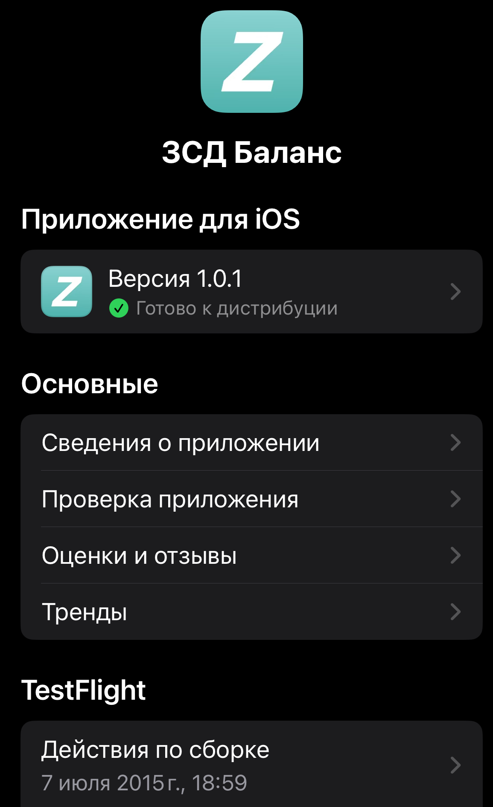
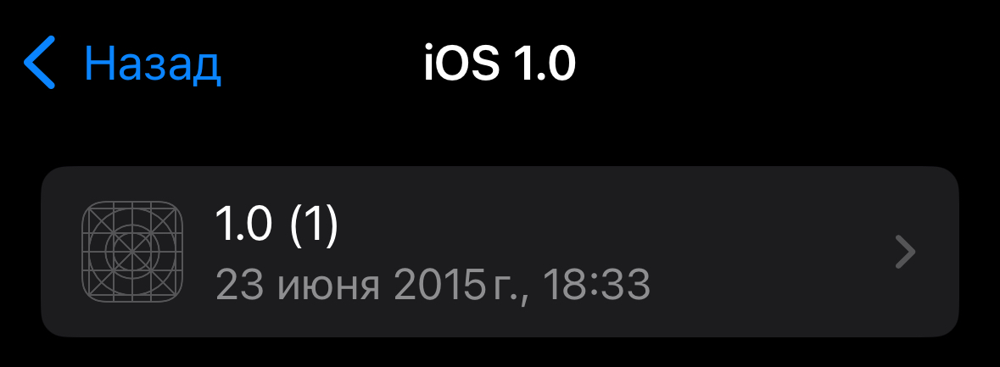
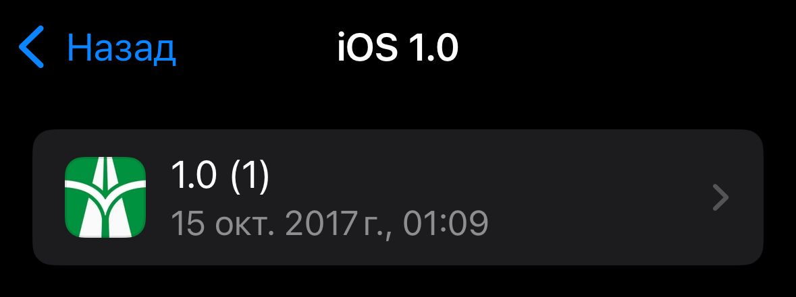
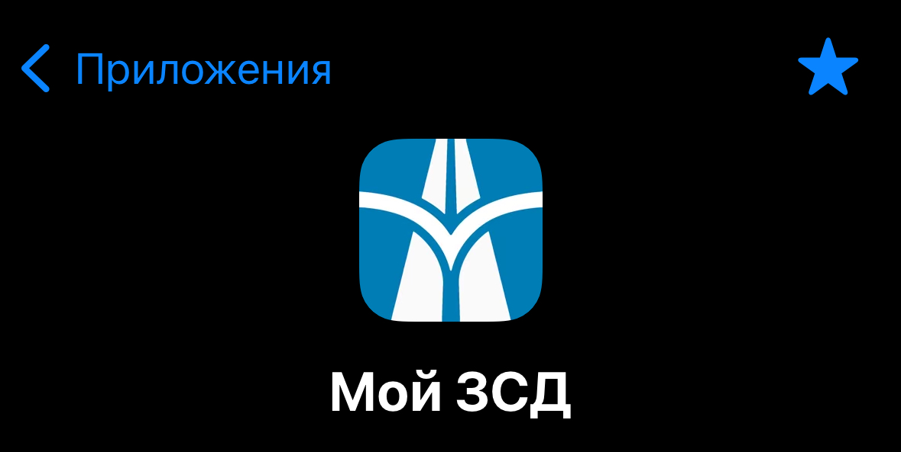

# История приложения

**2025 — год юбилейный! Уже 10 лет прошло с того момента, как я впервые решил разобраться, как сделать приложение для ЗСД.**

## От автора

Петербург всегда был городом-музой для творческих людей — уличных музыкантов, художников, поэтов... и, как оказалось, программистов тоже! 🎨💻  
Когда живёшь в городе, где мосты разводятся не только над Невой, но и над твоими идеями, невозможно не начать что-то создавать.  
Так и родилась история приложения для ЗСД — из любви к городу, дороге и немного к коду.

> ☕️ **Угостите автора чашечкой кофе**  
> [**Подарить кофе →**](https://pay.cloudtips.ru/p/6115a2d1)

---

> ⭐️ **Понравилось приложение?**  
> Поставьте оценку — это поможет другим пользователям найти его и поддержит проект!  
> [**Оценить в App Store →**](https://apps.apple.com/nl/app/%D0%BC%D0%BE%D0%B9-%D0%B7%D1%81%D0%B4/id1296603934)  
> [**Оценить в Google Play →**](https://play.google.com/store/apps/details?id=ru.spbmax.whsd&hl=ru)  

## 2015 год — рождение «ЗСД Баланс»

Дело было в 2015-м.  
Я тогда решил, что пора выйти за рамки web и попробовать что-то новое — выбор пал на свежевыходящий Swift.  

Нужна была идея для эксперимента.  
Я часто ездил по ЗСД и каждый раз страдал от того, что сайт постоянно выкидывал из аккаунта.  
Решение? Сделать своё приложение, которое показывает баланс и не требует логина каждые две недели.  

Так 23 июня 2015 года появилось первое приложение — **«ЗСД Баланс»**.  
Сегодня его уже не найти в App Store, но тогда оно было *единственным приложением для ЗСД вообще* — официального у компании еще не существовало.  

---

## 2017 год — новый виток: «Мой ЗСД»

В 2017 году я съездил на конференцию по React Native — и загорелся идеей сделать всё заново, но круче.  

Просто показывать баланс было уже скучно, поэтому я пошёл по пути реверс-инжиниринга: разобрал, как устроено API официального приложения, и написал свой клиент.  

Так появился **«Мой ЗСД»** — более умное, стабильное и удобное приложение, в котором можно было делать почти всё, что и в оригинале.  
Без вылетов, без разлогинивания, без боли.  

Логотип для новой версии нарисовала [Таня](https://t.me/exogenesis0) — спасибо ей за это!  

---

## 2018 год — упоминание в прессе

В 2018 году про приложение написали в [Собака.ру](https://www.sobaka.ru/lifestyle/technology/78414).  
Кстати, фото с видом на стадион и ЗСД в статье — тоже моё 🙂  

---

## 2021 год — редизайн и свежие краски

В 2021 году ко мне присоединилась [Лена](https://t.me/mslarkina), и мы устроили лёгкий, но стильный редизайн.  
Приложение посинело — в прямом смысле. Новая палитра в сине-золотых тонах вдохновлена цветом моей тогдашней машины 🚗✨  

---

## 2025 год — официальное приложение исчезло, а «Мой ЗСД» вернулся

### Апрель–Май

Прошло несколько лет.  
Я уже жил за пределами Петербурга, ЗСД не пользовался, и приложение потихоньку пылилось в App Store.  

Но вдруг — бац! — официальное приложение исчезает из магазина.  
А «Мой ЗСД» внезапно оказывается единственной рабочей альтернативой.  

Скачивания взлетают с **20–30 в день до 400–500**.  
Вместе с этим приходят и жалобы — что-то не работает, где-то вылетает.  

Я решаю вдохнуть в проект новую жизнь:  
пересобираю всё с нуля, обновляю зависимости, переписываю виджет и чиню то, что давно откладывал.  

Результат — **в мае 2025 выходит версия 4.1**, первая за три года.

---

### Ноябрь

К ноябрю выходит **версия 4.2**.  
Приложением пользуются уже **61 000 человек только на iOS**.  
Появилась функция привязки номера автомобиля к транспондеру.  
Из крупного пока не хватает только возможности оспаривать поездки — но всё впереди.  

---

## 2026 год — финальный штрих и большая переработка

### Апрель

В апреле 2026 года выходит **версия 4.3**.  
В приложении появляется **последняя крупная недостающая функция — оспаривание поездок**.  
После этого «Мой ЗСД» наконец-то закрыл весь основной сценарий, который пользователи ждали от современного приложения.  
А ещё приложение **снова появилось в Google Play**.  

Но на одной фиче дело не остановилось.  
Заодно было исправлено и улучшено множество разных аспектов приложения:  
полностью переработан **тарифный помощник**, заново собран **маршрутный калькулятор**, а весь UI оптимизирован под использование **с одним аккаунтом** — чтобы повседневные сценарии стали проще, чище и быстрее.  

---

## Что дальше?

Если вы хотите, чтобы приложение развивалось и получало новые фичи — поддержите автора ☕️  

* 👉 Тинькофф напрямую [https://www.tinkoff.ru/cf/5Y2zL1Bby8m](https://www.tinkoff.ru/cf/5Y2zL1Bby8m)
* 👉 Cloudtips [https://pay.cloudtips.ru/p/6115a2d1](https://pay.cloudtips.ru/p/6115a2d1)
